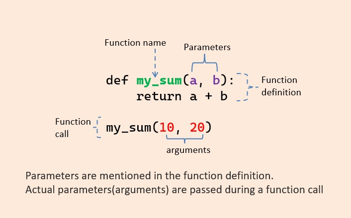

# land-mark

## Land Mark

### Introduction

[https://github.com/vietphan1995/land-mark.git](https://github.com/vietphan1995/land-mark.git)

✉️ [Send to email: vietphan95@outlook.com](mailto:vietphan95@outlook.com?subject=register_idea:land-mark_project&body=left_your_idea)

Land Mark is a software platform that you can host your data for many purposes like develop artificial intelligence, analyze data, host test data, mark data, share data, validate data in personal or in social.

Land Mark helps you browse and view data on intuitive user interface. Land Mark parameter view helps you design parameter in blueprint user interface or in list interface for a collection data of function.

Land Mark package helps you generate collection data by manipulate parameter in code, get collection data as input for your runtime job, mark data.

Land Mark supports manipulate in common collection datatypes like table, frame, document/object rows that has version control management, keeps data in one place as Land Mark cloud.

In advance, Land Mark improves research and analysis, creates more solution products for life by a wide bunch of data with high validation accuracy from collector and marker on sharing community, white/black box testing.

.

### [back to git projects …](https://github.com/vietphan1995/projects)

### Notes
https://phantrungviet.notion.site/land-mark-2575e832d6ee8025bcc5c55f43b71933